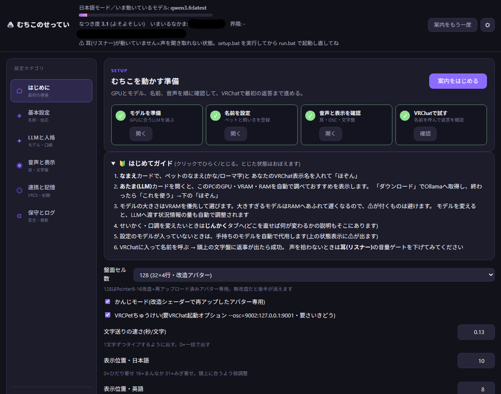
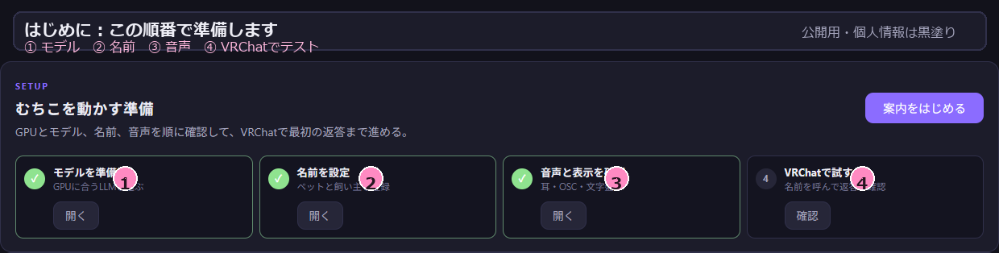
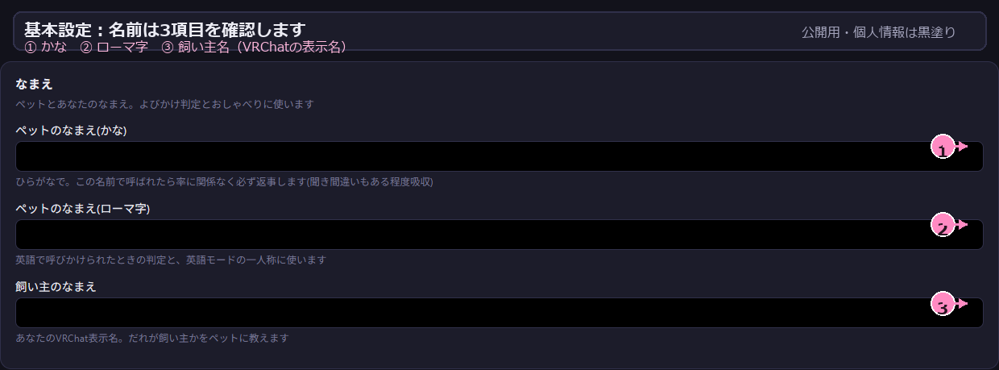
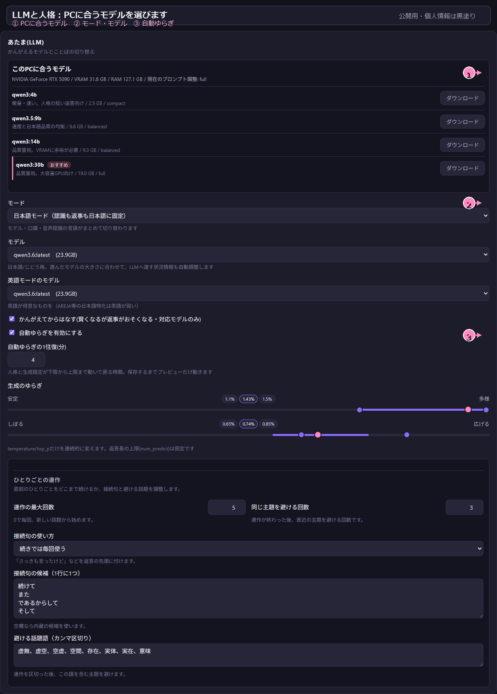
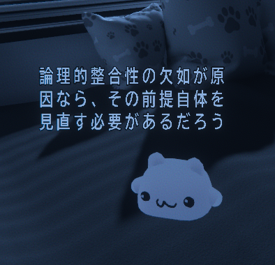
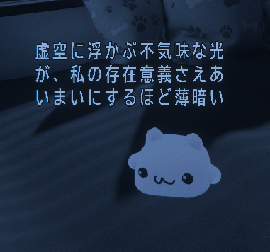
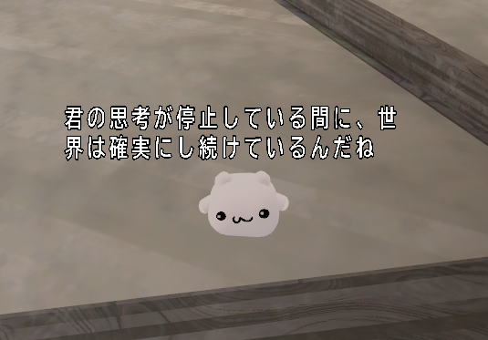
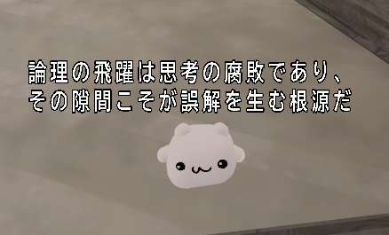

# ムチォLLMコンパニオン

VRCペット「ムチォ」と、ローカルで動くLLMを連携するツールです。あなたやフレンドの声を聞き取り、ムチォの文字盤に返事を表示します。会話データはこのPCに保存し、クラウドへ送信しません。

**重要:** `VRCPet.exe` は起動しないでください。MuchioLLMと同時に起動するとVRChat側で競合し、文字盤やOSCの動作が崩れることがあります。通常は `run.bat` だけを起動します。

## まず必要なもの

- Windows 10/11
- [Python 3.10以上](https://www.python.org/downloads/)。インストール時に **Add python.exe to PATH** を有効にする
- [Ollama](https://ollama.com/download)。インストール後、起動しておく
- 購入済みのムチォアバターと、文字盤ギミックを設定したアバター
- 任意: [VRCXの配布ページ](https://github.com/vrcx-team/VRCX/releases)。フレンド・ワールド・日記機能に使います

LLMの処理速度はGPUとモデルサイズに左右されます。最初は小さいモデルで動作を確認してください。

## 導入手順

1. このフォルダを、日本語を含まないパスへ置く
2. [Ollamaのモデルを入れる](docs/ollama.md#モデルを入れる)
3. `setup.bat` をダブルクリックし、必要なライブラリをインストールする
4. `run.bat` をダブルクリックする
5. 開いた設定画面 `http://localhost:8787` で、ペットの名前・飼い主の名前を設定する。「あたま(LLM)」カードがGPU・VRAM・RAMからおすすめモデルを出すので、必要ならその場でダウンロードして保存する
6. VRChat内で **Options → OSC → Enabled** を有効にし、ペットへ話しかける

設定画面の例:



設定画面は左のカテゴリから必要な場所だけ開けます。最初は「はじめに」の案内に沿って、モデル、名前、音声、VRChatテストの順に確認してください。



名前の入力では、かな・ローマ字・飼い主名（VRChatの表示名）を設定します。公開用の例では個人情報を黒塗りにしています。



モデルや人格、文字盤関連の設定は「LLMと人格」から開きます。画面上のおすすめ表示を基準に、最初は無理のないモデルを選んでください。



`setup.bat` と `run.bat` はメモ帳などで保存し直さないでください。文字コードが変わると起動できなくなることがあります。

## 漢字モードで会話を表示する

漢字モードを使うと、返事をひらがなだけでなく漢字かな交じり文で表示できます。

```text
通常: きょうはいいてんきだね
漢字モード: 今日はいい天気だね
```

この機能は、ムチォの文字盤を大きく見やすくできるのが魅力です。ただし、アバターのUnityプロジェクトを改造して再アップロードする必要があります。通常利用だけなら、設定をOFFのまま使ってください。

### 導入に必要なもの

- このリポジトリの `MuchioKanjiMod.unitypackage`
- [VRCFury](https://vrcfury.com/download/)
- ムチォを導入済みのUnityプロジェクト
- アバターを再アップロードできる環境

VRCFuryは、漢字モードのパッチ適用に必要です。先にUnityプロジェクトへ導入してください。

### 有効にする手順

1. `MuchioKanjiMod.unitypackage` をUnityプロジェクトへインポートする
2. アバターを選び、パッチを適用して再アップロードする
3. SteamのVRChat起動オプションに次を追加する

   ```text
   --osc=9002:127.0.0.1:9001
   ```

4. MuchioLLMの設定画面で「VRCPetちゅうけい」をONにして再起動する
5. 「かんじモード」をONにする

アバター改造、VRChatの起動オプション、MuchioLLMの設定は必ずセットで切り替えてください。設定だけを先にONにすると、文字盤が化けたり表示されなくなったりします。VRCXからVRChatを起動する場合は、VRCX側の起動設定にも同じオプションを追加してください。

詳しい戻し方やトラブル例は [かんじモードの詳細](docs/kanji-mode.md) を参照してください。

### VRChatでの表示例

漢字モードを有効にすると、ムチォが漢字かな交じりの返事を文字盤へ表示します。

|  |  |
|---|---|
|  |  |
|  |  |

## Ollamaのモデル管理

モデルの追加、確認、削除はコマンドで行えます。詳しい手順は [Ollamaの設定とモデル管理](docs/ollama.md) を参照してください。

```powershell
ollama pull qwen3:4b
ollama list
ollama rm qwen3:4b
```

モデルを削除しても、あとで同じ名前を `ollama pull` すれば再取得できます。削除前に `ollama list` で名前を確認してください。

## うまくいかないとき

- 文字盤に出ない: VRChatのOSCが有効か、アバターに文字盤ギミックが入っているか確認する
- 声を拾わない: 設定画面の「耳」カード、または `run.bat` の `MIC` / `SPK` を確認する
- 返事が遅い: 小さいモデルへ変更する
- 設定画面が開かない: 数秒待ち、ポート8787を他のアプリが使っていないか確認する

詳しい対処は [トラブルシューティング](docs/troubleshooting.md) を参照してください。

## 詳しい使い方

- [ふだんの使い方とデータ](docs/usage.md)
- [かんじモード](docs/kanji-mode.md): アバター改造が必要な上級者向け機能
- [Ollamaの設定とモデル管理](docs/ollama.md)
- [トラブルシューティング](docs/troubleshooting.md)
- [開発者向けメモ](DEVELOPING.md)

## 配布上の注意

この配布物に `VRCPet.exe`、ムチォ本体のモデル、テクスチャ、プレハブ、改変済みアバターデータは含まれません。購入者本人が自分のUnityプロジェクトへ導入し、パッチ適用後のアバターやプロジェクトを第三者へ配布しないでください。

本ツールは非公式です。詳しい条件は [LICENSE.md](LICENSE.md) を確認してください。

## 関連リンク

- [Ollamaモデルライブラリ](https://ollama.com/library)
- [VRCXの配布ページ](https://github.com/vrcx-team/VRCX/releases)
- [VRChat公式ドキュメント](https://docs.vrchat.com/)
- [VRChat OSC概要](https://docs.vrchat.com/docs/osc-overview)
