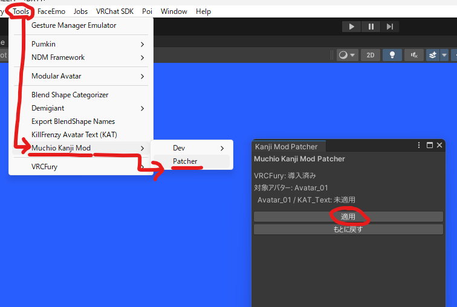
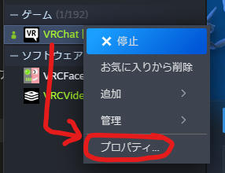
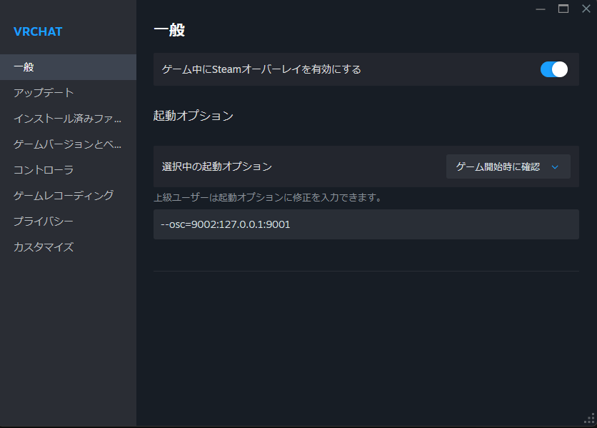
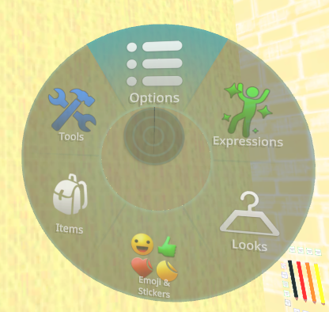
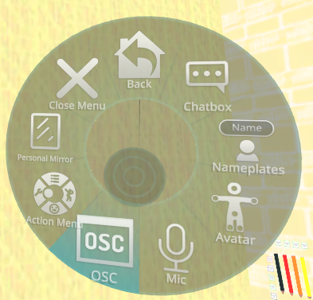
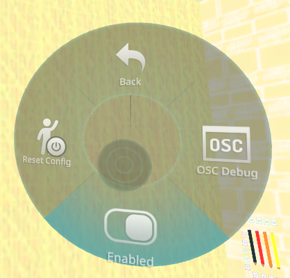

# かんじモード

かんじモードは、文字盤へ漢字かな交じり文を表示する上級者向け機能です。アバターのUnityプロジェクトを改造して再アップロードする必要があります。パッチ適用に [VRCFury](https://vrcfury.com/download/) を使うため、先にUnityプロジェクトへ導入してください。

改造しない場合は、設定画面の「かんじモード」をOFFのまま使ってください。

## 導入前の注意

かんじモードでは、次の3つを同じ状態にします。

1. アバター側のKAT改造
2. VRChatの起動オプション
3. MuchioLLMの設定

どれか1つだけ変更すると、文字盤に中国漢字が出る、文字がずれる、表示されないといった症状が出ます。

## 有効にする

1. [VRCFury](https://vrcfury.com/download/) をUnityプロジェクトへ導入する
2. `MuchioKanjiMod.unitypackage` をUnityプロジェクトへインポートする
3. アバターを選び、パッチを適用する

Unityのメニューから `Tools → Muchio Kanji Mod → Patcher → Kanji Mod Patcher` を開き、対象アバターを確認して「適用」を押します。



4. アバターを再アップロードする
5. SteamのVRChat起動オプションへ次を追加する

```text
--osc=9002:127.0.0.1:9001
```

Steamでは、ライブラリでVRChatを右クリックして「プロパティ」を開き、「起動オプション」へ入力します。





6. MuchioLLMの設定画面で「VRCPetちゅうけい」をONにする
7. MuchioLLMを再起動する
8. 「かんじモード」をONにする

VRCXからVRChatを起動する場合は、VRCX側の起動設定にも同じ起動オプションを追加してください。

## VRChatでOSCを有効にする

VRChat内のメニューで、次の順に開いてOSCを有効にします。

1. ラジアルメニューから「Options」を開く

   

2. 「OSC」を開く

   

3. 「Enabled」をONにする

   

起動オプションを変更したあとは、VRChatを再起動してください。VRCXから起動する場合は、SteamではなくVRCX側の起動設定を使います。

## 元に戻す

アバター側を通常のKAT設定へ戻し、起動オプションとMuchioLLMの「VRCPetちゅうけい」「かんじモード」をOFFにします。切り替えは3つをセットで行ってください。

## 詳細

文字盤のセル数、KATプロトコル、Unity側の改造内容は [DEVELOPING.md](../DEVELOPING.md) を参照してください。
