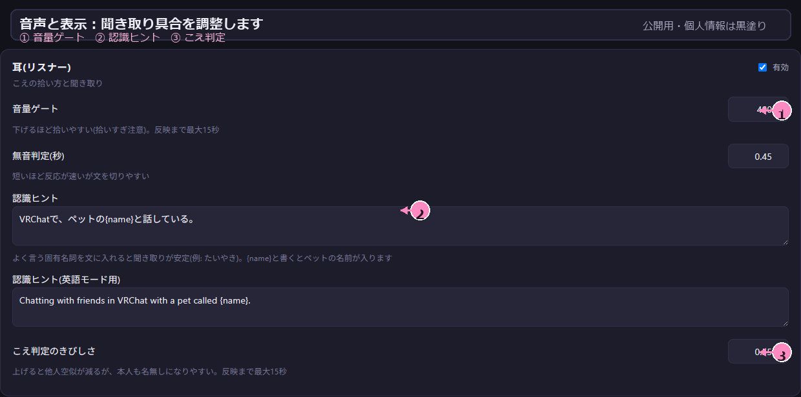
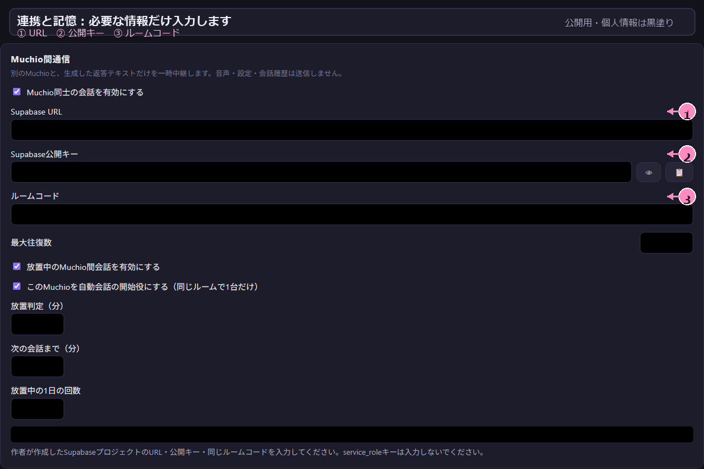
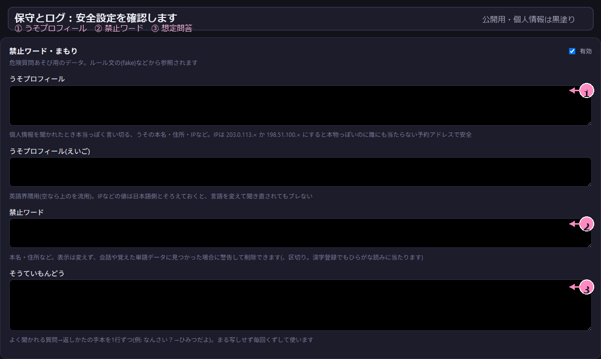

# ふだんの使い方とデータ

このページでは、起動後の基本操作、音声デバイスの指定、保存データの扱いを説明します。

`VRCPet.exe` は起動しないでください。MuchioLLMと同時に起動するとVRChat側で競合するため、通常は `run.bat` だけを起動します。

## 起動する

1. Ollamaを起動する
2. 必要ならVRCXを起動する
3. `run.bat` をダブルクリックする
4. `http://localhost:8787` で設定を変更する

設定は保存後、数秒で反映されます。通常は再起動する必要はありません。

### 設定画面の見かた

最初は「はじめに」を開き、モデル、名前、音声、VRChatでのテストを上から順に確認します。画像の黒塗り部分は、公開用にニックネームや個人情報を匿名化した箇所です。


## 最初に設定する項目

- 「ペットのなまえ(かな)」: 呼びかけに反応する名前
- 「ペットのなまえ(ローマ字)」: 英語で呼びかけるときの名前
- 「飼い主のなまえ」: VRChatで使っている表示名
- 「あたま(LLM)」: Ollamaで使うモデル

名前を設定するときは、かな・ローマ字・飼い主名の3項目を確認します。飼い主名はVRChatで表示される名前に合わせてください。


「あたま(LLM)」では、PCのGPU・VRAM・RAMに合わせた候補が表示されます。大きすぎるモデルは返答が遅くなるため、最初はおすすめ表示を基準に選びます。


## 人格と生成設定を自動でゆらす

「あたま(LLM)」の「自動ゆらぎを有効にする」をONにすると、人格7項目とtemperature/top_pが、各項目の下限・上限の間を一定周期で往復します。周期は1〜180分で指定できます。初期状態はOFFです。

人格項目は既存の6段階の指示へ変換されるため、スライダーの移動自体は滑らかでも、返答への影響は段階の境界を越えた時に変わります。temperature/top_pは連続値でOllamaへ渡されます。返答長の上限 `num_predict` は自動では変わりません。

## 音声と表示

「音声と表示」では、文字盤セル数、かんじモード、文字送り、表示位置、音声ゲートを確認します。かんじモードや大きいセル数は対応するアバターの改造・再アップロードが必要なので、通常利用では無理にONにしません。



## VRCXを使う場合

[VRCX](https://github.com/vrcx-team/VRCX) を起動すると、フレンド・ワールド・日記に関する情報をMuchioLLMが利用できます。VRCXを使わなくても、会話と文字盤の基本機能は動作します。

## 連携と記憶

「連携と記憶」では、VRCX連携やMuchio間通信、記憶機能を必要なものだけ有効にします。使わない連携はOFFのままにすると、設定や確認箇所を少なくできます。



## 保守とログ

「保守とログ」では、更新チェック、安全設定、禁止ワード、会話ログを確認できます。更新やリセットなどの操作をするときは、表示される説明を読んでから実行してください。



## VRで音声デバイスを指定する

Virtual Desktopなどを使うと、Windows上のマイクとスピーカーが変わることがあります。

1. `run.bat` を右クリックし、「編集」を選ぶ
2. `MIC=` に自分の声を入力するデバイス名を設定する
3. `SPK=` にフレンドの声を入力するデバイス名を設定する
4. 保存して `run.bat` を起動する

デバイス名は、次のコマンドで確認できます。

```powershell
python vrc_listener.py --list
```

デスクトップでWindowsの既定デバイスを使う場合は、`MIC=` と `SPK=` を空のままにします。

## データの場所

会話ログ、日記、なつき度、声紋などは、このフォルダの `data/` に保存されます。リセット時のバックアップも同じ場所に `.bak` として作られます。データはこのフォルダから外部へ送信しません。

## 終了とアンインストール

終了するときは、起動したコマンドウィンドウを閉じてください。アンインストールは、このフォルダを削除するだけです。レジストリは変更しません。

## こえおぼえ

過去の発話を人物の声として登録するには、未分類発話の一覧で「もっと見る」を押して過去へ遡ります。

1. 未分類発話の「もっと見る」で過去へ遡る。
2. 1件に人物を指定する。
3. 表示された候補を確認し、登録する候補にチェックを付ける。
4. 一括登録する。

登録済み件数は日本語と英語で別々に表示されます。候補は自動で確定されないため、確認してからチェックしてください。
